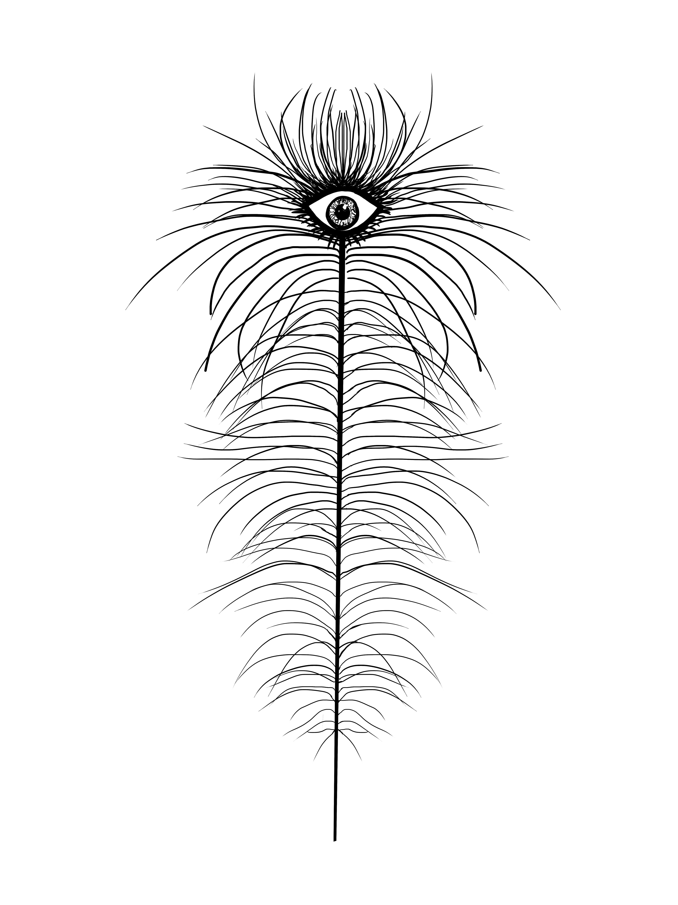
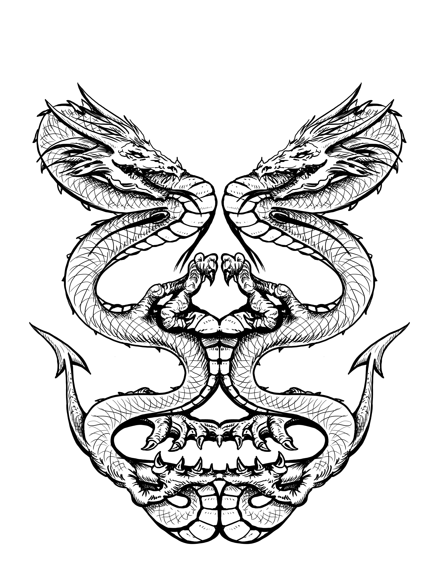
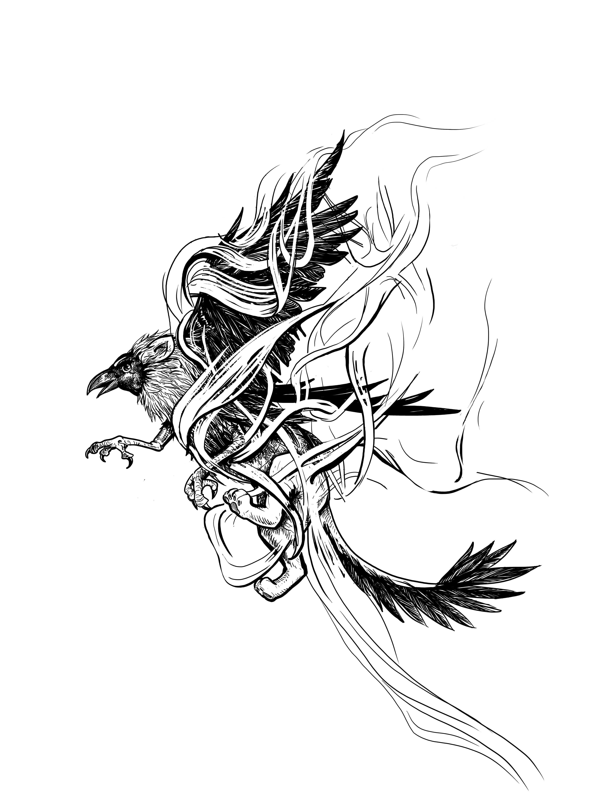
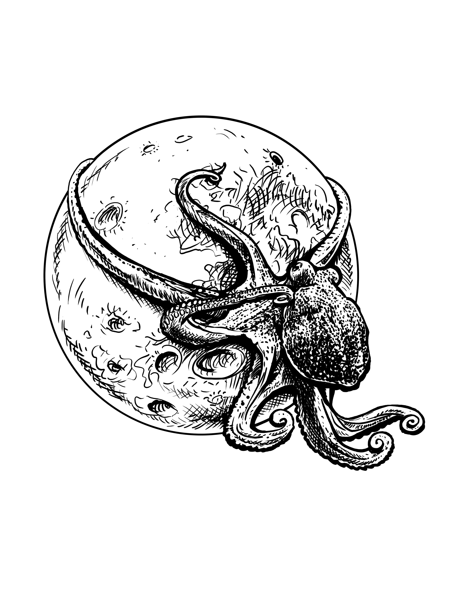
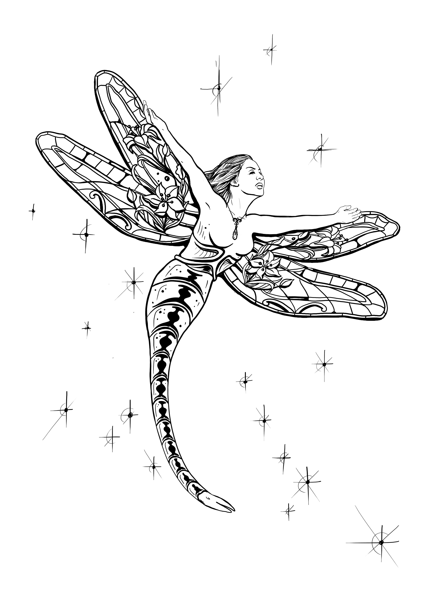

[<!DOCTYPE html>
<html lang="fr">
<head>
  <meta charset="UTF-8" />
  <meta name="viewport" content="width=device-width, initial-scale=1.0" />
  <title>La Bataille des Royaumes — La Nuit Magique</title>
  
</head>
<body>

  <header>
    

      

        
        

          <h1>La Bataille des Royaumes</h1>
          
La Nuit Magique — Classement et demandes de points

        

      

      

        <a href="#classement" class="btn">Classement</a>
        <a href="#demande" class="btn btn-primary">Demander des points</a>
      

    

  </header>

  <main class="container">
    <section class="hero">
      Fantasy • compétition • légende
      <h2>Huit Royaumes s'affrontent pour écrire l'histoire de la Nuit Magique.</h2>
      

        Suivez l'évolution des points de chaque Royaume, envoyez des demandes de points
        selon les actions accomplies, et faites progresser votre camp dans la grande
        bataille des Royaumes.
      

      

        <a href="#classement" class="btn btn-primary">Voir le classement</a>
        <a href="#demande" class="btn">Envoyer une demande</a>
      

    </section>

    <section class="section" id="classement">
      

        

          <h3>Classement actuel</h3>
          
Tous les Royaumes commencent à 0 point pour le lancement.

        

      

      

        <article class="panel podium-card gold">
          
1

          <h4>Augustus Nubium Mundus</h4>
          
0

          
Royaume d'or — à égalité au départ

        </article>

        <article class="panel podium-card green">
          
2

          <h4>Alcarah</h4>
          
0

          
Royaume vert — prêt à s'élever

        </article>

        <article class="panel podium-card red">
          
3

          <h4>Baldezor</h4>
          
0

          
Royaume rouge — prêt à conquérir

        </article>
      

      

        <article class="panel kingdom-card green">
          

            
          

          <h4>Alcarah</h4>
          
0

          

            Couleur
            <strong>Vert</strong>
          

        </article>

        <article class="panel kingdom-card gold">
          

            
          

          <h4>Augustus Nubium Mundus</h4>
          
0

          

            Couleur
            <strong>Or</strong>
          

        </article>

        <article class="panel kingdom-card red">
          

            
          

          <h4>Baldezor</h4>
          
0

          

            Couleur
            <strong>Rouge</strong>
          

        </article>

        <article class="panel kingdom-card black">
          

            
          

          <h4>Les Ombres de Grimelfe</h4>
          
0

          

            Couleur
            <strong>Noir</strong>
          

        </article>

        <article class="panel kingdom-card bordeaux">
          

            
          

          <h4>Lunerei</h4>
          
0

          

            Couleur
            <strong>Bordeaux</strong>
          

        </article>

        <article class="panel kingdom-card blue">
          

            
          

          <h4>Sappheiros</h4>
          
0

          

            Couleur
            <strong>Bleu clair</strong>
          

        </article>

        <article class="panel kingdom-card violet">
          

            
          

          <h4>Les Terres de Sang</h4>
          
0

          

            Couleur
            <strong>Violet</strong>
          

        </article>

        <article class="panel kingdom-card orange">
          

            
          

          <h4>Témeriah</h4>
          
0

          

            Couleur
            <strong>Orange</strong>
          

        </article>
      

    </section>

    <section class="section" id="demande">
      

        

          <h3>Demander des points</h3>
          
Chaque demande sera vérifiée avant validation par l’administration.

        

      

      

        <article class="panel form-panel">
          <h4>Formulaire public</h4>

          

            <label for="nom">Nom / pseudo</label>
            <input id="nom" type="text" placeholder="Ex. Florian">
          

          

            <label for="email">Email</label>
            <input id="email" type="email" placeholder="exemple@mail.com">
          

          

            <label for="royaume">Royaume</label>
            <select id="royaume">
              <option>Alcarah</option>
              <option>Augustus Nubium Mundus</option>
              <option>Baldezor</option>
              <option>Les Ombres de Grimelfe</option>
              <option>Lunerei</option>
              <option>Sappheiros</option>
              <option>Les Terres de Sang</option>
              <option>Témeriah</option>
            </select>
          

          

            <label for="action">Action réalisée</label>
            <select id="action">
              <option>Venir aider au bureau — 100 points</option>
              <option>Distribution de flyers — 500 points</option>
              <option>Amener un nouveau bénévole — 1000 points</option>
            </select>
          

          

            <label for="preuve">Commentaire / preuve</label>
            <textarea id="preuve" placeholder="Ajoute une date, un détail, une précision, ou un lien vers une preuve."></textarea>
          

          <a href="#" class="btn btn-primary">Envoyer la demande</a>
        </article>

        <aside class="panel info-panel">
          <h4>Actions disponibles</h4>
          

            Cette première version affiche déjà l’univers, les Royaumes, les points
            et le formulaire. Ensuite, on branchera la vraie logique pour enregistrer
            les demandes, les approuver et mettre à jour les scores automatiquement.
          

          

            

              Venir aider au bureau
              +100
            

            

              Distribution de flyers
              +500
            

            

              Amener un nouveau bénévole
              +1000
            

          

        </aside>
      

    </section>

    <section class="section">
      

        <h4>Prochaine étape</h4>
        

          On ajoute ensuite un vrai système avec envoi des demandes, espace admin de validation,
          et mise à jour automatique du score de chaque Royaume.
        

      

    </section>
  </main>

  <footer class="container">
    La Nuit Magique — La Bataille des Royaumes
  </footer>

</body>
</html>
](https://flowtown.github.io/LA-BATAILLE-DES-ROYAUMES/)
